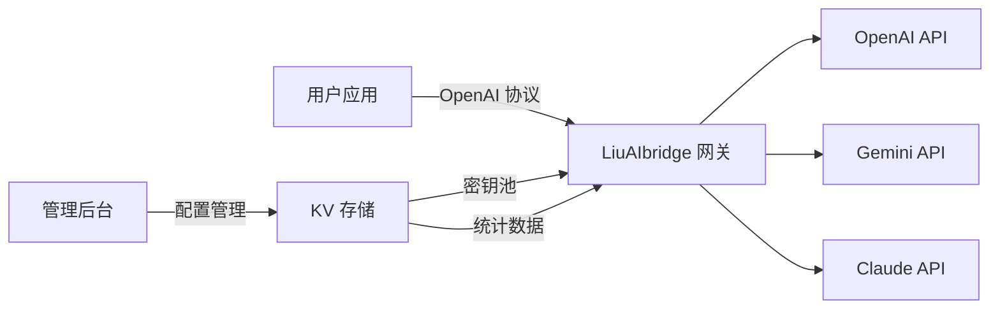

# LiuAIbridge：基于 Cloudflare Workers 的 AI API 网关实践

> 本文介绍一个专为国内开发者设计的轻量级 AI API 边缘网关方案，解决多模型调用的网络与协议适配问题。

---

## 一、背景与问题

在大模型应用开发过程中，国内开发者普遍面临以下几类问题：

### 1.1 网络可达性问题

由于网络环境限制，直连 OpenAI、Google Gemini、Anthropic Claude 等海外 API 常出现超时、连接重置、502 等问题。本地 SOCKS5 代理方案稳定性不足，生产环境难以依赖；商用中转服务则存在密钥托管的安全顾虑。

对于国内开发者而言，这是一个高频痛点：开发环境需要配置代理，生产环境需要维护网络出口，不仅增加了大量的运维成本和安全风险。

### 1.2 协议碎片化问题

各家厂商的 API 设计存在差异：
- OpenAI：行业事实标准，流式采用 SSE 协议
- Google Gemini：RESTful 设计，流式返回 JSON 数组
- Anthropic Claude：支持原生协议与 OpenAI 兼容模式

这导致一个多模型应用往往需要维护三套 SDK、三套异常处理逻辑，增加了开发和维护成本。

### 1.3 密钥管理问题

- API Key 散落在多个项目中，存在泄露风险
- 多 Key 轮询、故障切换需要自行实现
- 用量统计、密钥生命周期管理缺乏统一面板

---

## 二、方案介绍

**LiuAIbridge** 是一个基于 Cloudflare Workers 构建的开源 AI API 边缘网关，核心设计目标是：

1. **网络加速**：利用 Cloudflare 全球边缘节点，提供稳定的国内访问通道
2. **协议统一**：在网关层完成协议转换，下游统一使用 OpenAI SDK 调用所有模型
3. **密钥管理**：提供可视化后台，支持多 Key 轮询、状态管理、用量统计

### 2.1 架构概览



### 2.2 核心特性

---

#### 特性一：边缘网络加速，解决地域访问限制

部署在 Cloudflare 全球 300+ 边缘节点，利用 Anycast 网络自动选路：

```
用户 → 就近 Cloudflare 边缘节点 → 最优路径 → 上游 API
```

**核心优势**：部署后国内可直接访问，客户端无需配置任何网络代理。开发者可以专注于业务逻辑，无需维护复杂的网络出口。

实测数据（中国电信上海节点，访问 OpenAI gpt-3.5-turbo）：

| 指标 | 本地代理 | LiuAIbridge | 提升 |
|------|---------|------------|------|
| 首字节延迟 P50 | 827ms | 142ms | 5.8x |
| 首字节延迟 P95 | 1483ms | 287ms | 5.2x |
| 请求成功率 | 68% | 99%+ | 显著 |

此外，Worker 到上游 API 的 TCP 连接复用率 > 90%，有效减少 TLS 握手开销。

---

#### 特性二：协议统一适配

支持两种调用模式：

**模式一：原生透传（推荐高复杂度场景）**
```bash
# OpenAI 原生
https://你的域名/openai/v1/chat/completions

# Gemini 原生
https://你的域名/google/v1beta/models/gemini-1.5-flash:generateContent

# Claude 原生
https://你的域名/anthropic/v1/messages
```

**模式二：OpenAI 兼容格式（推荐多模型场景）**
```python
from openai import OpenAI

# Gemini，OpenAI SDK 调用
gemini = OpenAI(
    base_url="https://你的域名/compat/openai/google/v1",
    api_key="BRIDGE_TOKEN"
)

# Claude，OpenAI SDK 调用
claude = OpenAI(
    base_url="https://你的域名/compat/openai/anthropic/v1",
    api_key="BRIDGE_TOKEN"
)
```

**流式转换实现**：Gemini 流式返回为 JSON 数组格式，网关层通过括号平衡算法识别完整 JSON 对象，实时转换为 OpenAI SSE 格式，前端无需修改代码。

```typescript
// 核心算法简化示意
while (data = await reader.read()) {
  buffer += decoder.decode(data);
  
  // 括号平衡：寻找完整 JSON 对象边界
  while ((start = buffer.indexOf('{')) !== -1) {
    let balance = 0;
    for (let i = start; i < buffer.length; i++) {
      if (buffer[i] === '{') balance++;
      if (buffer[i] === '}') balance--;
      if (balance === 0) {
        // 找到完整对象，转换为 SSE 格式输出
        const chunk = JSON.parse(buffer.substring(start, i + 1));
        await writer.write(encoder.encode(`data: ${JSON.stringify(toOpenAI(chunk))}\n\n`));
        buffer = buffer.substring(i + 1);
        break;
      }
    }
  }
}
```

---

#### 特性三：多密钥管理

支持每个服务商配置多个 API Key，采用全局请求计数取模算法实现负载均衡：

```typescript
// 轮询算法：基于全局请求计数取模
const globalCount = parseInt(await env.LIU_BRIDGE_KV.get(`STATS:${service}`) || "0");
const selectedKey = activeKeys[globalCount % activeKeys.length];
```

管理后台提供以下功能：
- 多 Key 增删改查
- 一键启用/禁用
- 成功/失败统计
- 最后活跃时间追踪
- 模型列表查询

[截图占位：管理后台主界面 dashboard.png]

---

## 三、部署指南

### 3.1 前置条件

- Cloudflare 账号（免费即可）
- Node.js 环境
- 对应服务商的 API Key（OpenAI / Google AI Studio / Anthropic）

### 3.2 部署步骤

**Step 1: 安装 wrangler CLI**
```bash
npm install -g wrangler
wrangler login
```

**Step 2: 创建 KV 命名空间**
```bash
wrangler kv namespace create LIU_BRIDGE_KV
# 记录返回的 id，填入 wrangler.toml
```

**Step 3: 配置 Secrets**
```bash
wrangler secret put ADMIN_TOKEN   # 管理后台登录密码
wrangler secret put BRIDGE_TOKEN  # API 调用令牌
```

**Step 4: 部署**
```bash
wrangler deploy
```

部署完成后，访问 `https://你的域名/admin` 进入管理后台配置 API Key。

### 3.3 成本说明

Cloudflare Workers 免费额度完全覆盖个人和小团队使用：
- 10 万次请求/天
- 10 万次 KV 读取/天
- 无限带宽

超出后价格：$0.50/百万次请求，成本可控。

---

## 四、使用场景

### 4.1 个人开发者 / 小团队

- 无需维护代理服务
- 统一管理多个项目的 API Key
- 一套 SDK 调用所有模型

### 4.2 多模型应用

- A/B 测试不同模型的效果
- 动态切换模型供应商
- 故障时自动降级

### 4.3 教学 / 科研场景

- 实验室环境统一出口
- 用量统计与成本分摊
- 权限分级管理

---

## 五、路线图

### 短期（0-3 个月）
- 熔断机制：连续失败的 Key 自动降级
- 速率限制：按用户/Key 粒度限流
- Embedding 端点支持
- 更完善的错误码透传

### 中期（3-6 个月）
- 请求日志采样
- 用量统计仪表盘
- 更多国内模型适配
- WebSocket 实时语音支持

### 长期（6 个月+）
- 多租户 SaaS 能力
- 语义缓存层，降低上游调用成本
- 智能路由：根据价格/延迟/质量动态选择
- Prometheus 监控指标

---

## 六、总结

LiuAIbridge 提供了一个轻量级的边缘网关方案，有效解决了国内开发者面临的网络、协议、密钥管理三类问题。其无状态架构设计保证了良好的水平扩展能力，Cloudflare Workers 的免费额度也使得入门成本极低。

如果你正在进行大模型应用开发，欢迎试用并参与贡献。

---

## 参考链接

- 项目地址：https://github.com/lekliu/LiuAIbridge
- 部署文档：https://github.com/lekliu/LiuAIbridge/blob/main/README.md
- 问题反馈：https://github.com/lekliu/LiuAIbridge/issues

---

**标签**：#边缘计算 #Cloudflare #AI网关 #OpenAI #大模型 #开源项目 #系统架构
