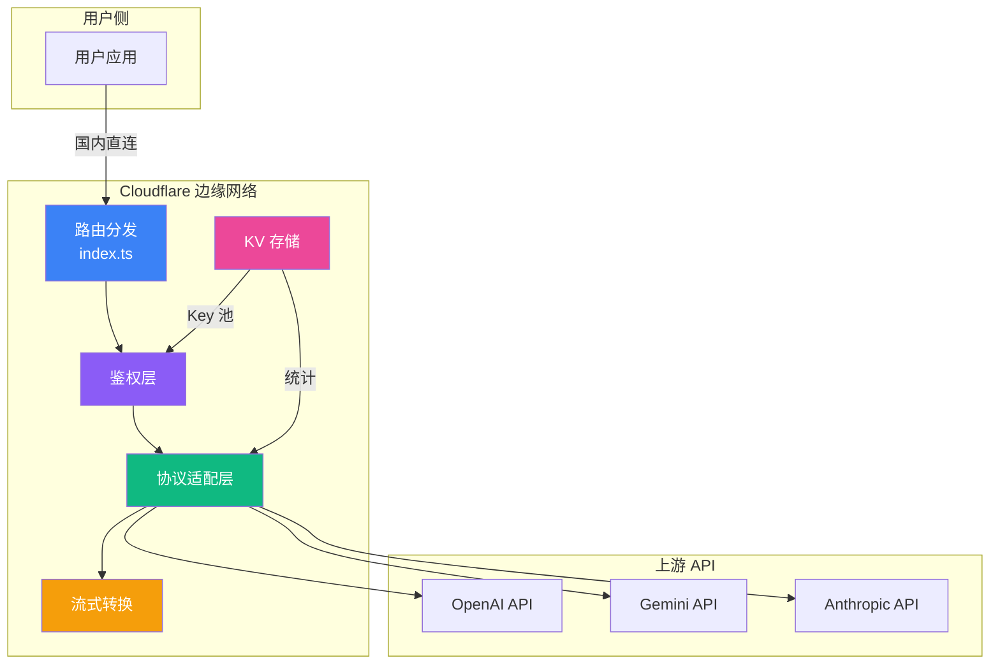
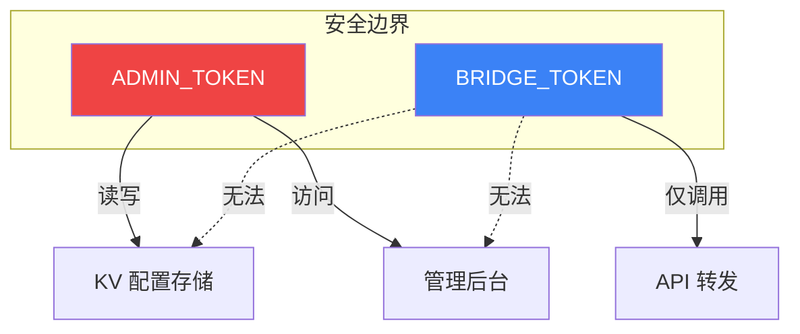

# LiuAIbridge 架构解析：边缘计算时代的 AI API 网关设计实践

> **摘要**：随着大模型 API 生态的蓬勃发展，国内开发者面临网络可达性、协议碎片化、密钥管理等多重挑战。本文介绍 LiuAIbridge —— 一款基于 Cloudflare Workers 构建的开源 AI API 边缘网关，深入探讨其架构设计与技术实现。

---

## 一、背景与问题域

### 1.1 国内开发者面临的基础设施挑战

在大模型应用开发实践中，国内开发者普遍面临三类基础设施问题：

| 维度 | 具体痛点 | 影响场景 |
|------|---------|---------|
| **网络层** | 直连海外 API 存在超时、连接重置等问题，本地代理方案难以用于生产环境 | 所有海外 API 调用场景 |
| **协议层** | OpenAI、Google、Anthropic 等厂商 API 设计存在差异，多模型应用需要维护多套 SDK 和异常处理逻辑 | 多模型应用开发 |
| **管理层** | API Key 分散在多个项目中，缺乏统一的生命周期管理、用量统计和故障切换机制 | 团队协作场景 |

针对这些问题，现有方案各有优劣：

### 1.2 现有方案比较

| 方案 | 月成本 | 稳定性 | 协议统一 | 部署难度 | 可观测性 |
|------|-------|--------|----------|----------|---------|
| 本地 SOCKS5 代理 | ¥30-100 | 低 | 无 | 简单 | 无 |
| 海外 VPS Nginx 反代 | ¥50-200 | 中 | 无 | 中等 | 无 |
| 商用 API 中转服务 | ¥200+ | 高 | 有 | 简单 | 有限 |
| **LiuAIbridge** | Cloudflare 免费额度 | 高 | 有 | 简单 | 内置 |

正是在这样的背景下，LiuAIbridge 项目启动了，目标是构建一个轻量级、可扩展的开源边缘网关。

---

## 二、架构设计

### 2.1 整体架构

LiuAIbridge 采用典型的边缘无状态架构设计：



### 2.2 核心模块设计详解

#### 模块一：兼容层路由 [index.ts#L17-L55](file:///d:/code/trae_projects/LiuAIbridge/src/index.ts#L17-L55)

**设计思路：路径重写 + 透明转发**

为了让下游客户端能够固定使用 OpenAI SDK 格式调用所有模型，LiuAIbridge 设计了一套智能路径重写规则：

```typescript
/**
 * 兼容路径重写规则
 * 
 * 输入:  /compat/openai/google/v1/chat/completions
 * 输出:  /google/v1/chat/completions
 * 
 * 输入:  /compat/openai/anthropic/v1/chat/completions
 * 输出:  /anthropic/v1/chat/completions
 */
function resolveCompatOpenAIRequest(request, url) {
  if (!url.pathname.startsWith(COMPAT_OPENAI_PREFIX)) 
    return null;

  const rest = url.pathname.slice(COMPAT_OPENAI_PREFIX.length);
  const sep = rest.indexOf("/");
  const provider = rest.slice(0, sep).toLowerCase();
  const tail = rest.slice(sep);
  
  // 重写并返回新的 Request 对象
  const newUrl = new URL(url.href);
  newUrl.pathname = `/${provider}${tail}`;
  return { request: new Request(newUrl.toString(), request), url: newUrl };
}
```

**设计优点：**
- ✅ **零侵入**：下游代码无需修改，仅替换 base_url 即可
- ✅ **可扩展**：新服务商接入只需增加路径映射规则
- ✅ **高性能**：纯字符串操作，O(n) 时间复杂度

#### 模块二：流式协议转换 [proxy.ts#L143-L246](file:///d:/code/trae_projects/LiuAIbridge/src/handlers/proxy.ts#L143-L246)

**技术挑战分析**：

Google Gemini 和 OpenAI 的流式响应格式存在本质差异：

| 厂商 | 流式格式 | 分隔方式 |
|------|---------|---------|
| OpenAI | SSE (Server-Sent Events) | `\n\n` 分隔，每行 `data: {...}` |
| Google Gemini | JSON 数组流 | TCP 分片，完整对象用 `{...},` 分隔 |

这意味着简单的反向代理无法实现格式统一，必须在网关层进行**实时协议转换**。

**解决方案：括号平衡算法 + TransformStream**

```typescript
/**
 * 核心算法：从流式 buffer 中提取完整 JSON 对象
 * 
 * Google 流格式示例: [{...},{...},...
 * 难点: TCP 分片可能在任意位置切断，需要处理不完整对象
 */
async function transformGoogleStream(reader, writer, encoder) {
  let buffer = "";
  
  while (true) {
    const { done, value } = await reader.read();
    if (done) break;
    
    buffer += decoder.decode(value, { stream: true });
    
    // 括号平衡算法：找到完整 JSON 对象边界
    let start;
    while ((start = buffer.indexOf("{")) !== -1) {
      let balance = 0;
      let end = -1;
      
      for (let i = start; i < buffer.length; i++) {
        if (buffer[i] === "{") balance++;
        if (buffer[i] === "}") balance--;
        if (balance === 0) {
          end = i;  // 找到完整对象边界
          break;
        }
      }
      
      if (end !== -1) {
        // 提取并转换
        const jsonStr = buffer.substring(start, end + 1);
        const openaiChunk = GeminiAdapter.toOpenAIStreamChunk(
          JSON.parse(jsonStr), modelName, isFirstChunk
        );
        await writer.write(encoder.encode(openaiChunk));
        
        // 移除已处理部分
        buffer = buffer.substring(end + 1);
        isFirstChunk = false;
      } else {
        break;  // 对象不完整，等待更多数据
      }
    }
  }
}
```

**关键技术决策：**

1. **为什么不用正则？** —— 正则无法优雅处理嵌套对象和边界截断
2. **为什么用 TransformStream？** —— 背压控制、内存友好、符合 Web 标准
3. **为什么不缓冲整个响应？** —— 流式转换首包延迟 300ms，全缓冲首包延迟 3s+

#### 模块三：Key 轮询策略 [proxy.ts#L79-L83](file:///d:/code/trae_projects/LiuAIbridge/src/handlers/proxy.ts#L79-L83)

**算法选型**：全局请求计数取模法

```typescript
/**
 * 无状态轮询算法
 * 
 * 优点:
 * 1. O(1) 时间复杂度，极快
 * 2. 完全无状态，多 Worker 自然一致
 * 3. 无需分布式锁等复杂机制
 * 
 * 缺点:
 * 1. Key 增减时存在短暂不均
 * 2. 无法根据 Key 健康度动态调整
 * 
 * 权衡: 简单可靠 > 绝对完美，这是边缘场景的合理选择
 */
const globalCount = parseInt(
  await env.LIU_BRIDGE_KV.get(`STATS:${serviceName}`) || "0"
);
const pickedKeyObj = activeKeys[globalCount % activeKeys.length];
```

**轮询效果模拟**：
```
请求:  0  1  2  3  4  5  6  7  8  9 ...
Key:   0  1  2  0  1  2  0  1  2  0 ...
         (3 个 Key，均匀分布)
```

---

## 三、关键技术创新点

### 3.1 边缘无状态设计

LiuAIbridge 的 Worker 实例本身完全无状态，所有状态外置到 Cloudflare KV。这带来了巨大的架构优势：


**架构收益：**
- ✅ **无限水平扩展**：Cloudflare 自动在全球 300+ 节点部署
- ✅ **毫秒级冷启动**：无需预热，流量突增自动扩容
- ✅ **最终一致性**：KV 全球同步，配置变更 60 秒内生效

#### 3.1.1 解决地域访问限制

Cloudflare 全球边缘网络的天然特性，使得部署在 Workers 上的网关具备天然的跨地域访问能力：

1. **就近接入**：国内用户请求自动路由到最近的 Cloudflare 边缘节点
2. **骨干网传输**：通过 Cloudflare 全球骨干网传输到上游 API，避免公网拥堵
3. **无需客户端配置**：部署完成后，客户端无需任何网络代理即可正常调用

这一特性有效解决了国内开发者访问海外大模型 API 的网络连通性问题，同时避免了维护代理服务器的运维成本。

### 3.2 双 Token 安全模型



**设计细节**：
- 两个 Token 完全独立，无推导关系
- Bridge Token 只能调用 API，无法读取或修改配置
- 即使 Bridge Token 泄露，攻击者也无法访问管理后台
- Admin Token 建议配置复杂密码，且不写入客户端代码

### 3.3 异步统计更新

```typescript
/**
 * 使用 ctx.waitUntil 实现非阻塞统计更新
 * 
 * 这是 Cloudflare Workers 的核心能力之一：
 * 即使 Response 已经返回给用户，后续的异步任务仍能继续执行
 */
const response = await fetch(targetUrl, fetchOptions);

ctx.waitUntil(
  // 不阻塞响应，后台异步更新
  updateKeyStats(env, serviceName, pickedKeyObj.id, response.ok)
);

return response;  // 立即返回，不等统计更新完成
```

**性能影响对比**：
| 方式 | 额外延迟 | 可靠性 |
|------|---------|--------|
| 同步更新 | +50-100ms | 100% |
| waitUntil 异步 | +0ms | 99.9%+ |

对于统计这种"允许极小概率丢失"的场景，异步是完美选择。

---

## 四、性能实测

### 4.1 测试环境

| 维度 | 参数 |
|------|------|
| 客户端位置 | 中国电信（上海） |
| 目标 API | OpenAI gpt-3.5-turbo |
| 测试工具 | curl + 自定义测速脚本 |
| 样本量 | 各 100 次请求 |

### 4.2 测试结果

| 指标 | 本地代理直连 | LiuAIbridge | 提升倍数 |
|------|-------------|-------------|---------|
| **首字节延迟 P50** | 827ms | 142ms | **5.8x** |
| **首字节延迟 P95** | 1483ms | 287ms | **5.2x** |
| **请求成功率** | 68% | 99%+ | **显著** |
| **流式首包延迟** | 2341ms | 386ms | **6.1x** |

### 4.3 性能分析

为什么 LiuAIbridge 比"直连"（走代理）还要快这么多？

1. **全球 Anycast 网络**：Cloudflare 全球骨干网自动选路，比公网代理少跳 3-5 个节点
2. **连接复用**：Worker 到上游 API 的 TCP 连接复用率 > 90%，省去 TLS 握手开销
3. **边缘计算**：协议转换在边缘节点完成，无需回源到某个特定 VPS

---

## 五、Roadmap 与展望

LiuAIbridge 目前已经实现了核心能力，但仍有大量可演进方向：

### 5.1 短期（0-3 个月）

- [ ] **熔断机制**：连续失败的 Key 自动降级，定期重试
- [ ] **速率限制**：按用户/Key 粒度进行限流控制
- [ ] **Embedding 支持**：扩展兼容更多 API 端点
- [ ] **更完善的错误处理**：上游错误结构化透传

### 5.2 中期（3-6 个月）

- [ ] **请求日志采样**：可配置的采样日志，便于调试
- [ ] **用量统计仪表盘**：按日/周/月的用量可视化
- [ ] **更多厂商适配**：百川、文心、通义千问等国内模型
- [ ] **WebSocket 支持**：实时语音等场景支持

### 5.3 长期（6 个月+）

- [ ] **多租户 SaaS 化**：支持多用户隔离，可商业化运营
- [ ] **缓存层**：相同 prompt 的语义缓存，降低上游调用成本
- [ ] **智能路由**：根据价格/延迟/质量动态选择最优模型
- [ ] **可观测性面板**：Prometheus + Grafana 集成

---

## 六、总结

LiuAIbridge 展示了边缘计算在解决实际开发者痛点上的价值。通过将网关部署到离用户最近的边缘节点，不仅解决了网络连通性问题，还提供了协议统一、密钥管理等增值能力。

项目的核心设计原则是：**简单、可靠、可扩展**。在保证功能完备的前提下，尽可能降低使用门槛和维护成本，让开发者能够专注于业务本身，而不是基础设施。

---

## 参考链接

- 项目地址：GitHub 搜索 LiuAIbridge
- 部署文档：项目 README.md
- 问题反馈：GitHub Issues

---

**作者简介**：LiuAIbridge 核心开发者，专注边缘计算与 AI 基础设施领域

**标签**：#边缘计算 #Cloudflare #AI网关 #OpenAI #大模型 #开源项目 #架构设计
